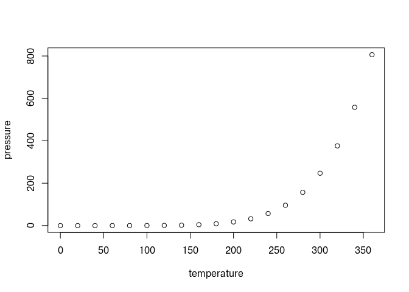

<!-- README.md is generated from README.Rmd. Please edit that file -->

# Rescience - Setting up for Reproducible Science

<!-- badges: start -->

[](https://lifecycle.r-lib.org/articles/stages.html#experimental)
<!-- badges: end -->

The goal of rescience is to provide an easy framework to test different
preprocessing and machine learning methods while minimizing the risk of
overfitting.

## Installation

You can install the development version of rescience from
[GitHub](https://github.com/JohanLassen/rescience) with:

``` r
# install.packages("devtools")
devtools::install_github("JohanLassen/rescience")
```

## Example

This is a basic example which shows you how to solve a common problem:

``` r
library(rescience)

# dataset
pneumonia <- data(pneumonia)
#> Warning in data(pneumonia): data set 'pneumonia' not found
#head(pneumonia)
```

To statistically analyze this data it must undergo (1) selection of
important variables including outcome, batch, and technical replicates,
(2) preprocessing to ensure that all features and compounds are within
the same range of values and to minimize batch effect, (3) perform a
machine learning model screening to evaluate which model fits the data
best.

Point 2 and 3 requires the analyst to be careful, read more here.

# The simple way to do it

The package is accompanied with a web app that ensures that a broad
range of users can confidently use the methods. The app exists as an
online version to show case the setup, but we recommend users to install
R, Rstudio, and this package to experience the best performance.

To run the app:

``` r
#run_app()
```

# Diving deeper

The true beauty of the package reveals itself when developing custom
scripts and implementing your own functions.

We strive to include as many different methods as possible to
accommodate methodological studies on batch effect, machine learning
algorithms, and model interpretation. Hence, it should be as easy as
possible to contribute to the package by writing functions that fits the

``` r
summary(cars)
#>      speed           dist       
#>  Min.   : 4.0   Min.   :  2.00  
#>  1st Qu.:12.0   1st Qu.: 26.00  
#>  Median :15.0   Median : 36.00  
#>  Mean   :15.4   Mean   : 42.98  
#>  3rd Qu.:19.0   3rd Qu.: 56.00  
#>  Max.   :25.0   Max.   :120.00
```

You’ll still need to render `README.Rmd` regularly, to keep `README.md`
up-to-date. `devtools::build_readme()` is handy for this. You could also
use GitHub Actions to re-render `README.Rmd` every time you push. An
example workflow can be found here:
<https://github.com/r-lib/actions/tree/v1/examples>.

You can also embed plots, for example:



In that case, don’t forget to commit and push the resulting figure
files, so they display on GitHub and CRAN.
