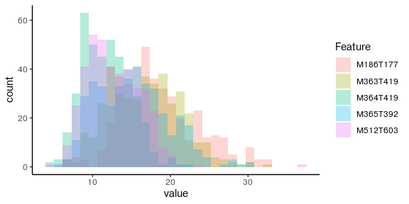

<!-- README.md is generated from README.Rmd. Please edit that file -->

# Rescience - Setting up for Reproducible Science

<!-- badges: start -->

[](https://lifecycle.r-lib.org/articles/stages.html#experimental)
<!-- badges: end -->

The goal of rescience is to provide an easy framework to test different
preprocessing and machine learning methods while minimizing the risk of
overfitting.

## Installation

You can install the development version of rescience from
[GitHub](https://github.com/JohanLassen/rescience) with:

``` r
# install.packages("devtools")
devtools::install_github("JohanLassen/rescience")
```

## Example

This is a basic example which shows you how to solve a common problem:

``` r

library(rescience)
library(tidyverse)
#> ── Attaching packages ─────────────────────────────────────── tidyverse 1.3.1 ──
#> ✔ ggplot2 3.3.6     ✔ purrr   0.3.4
#> ✔ tibble  3.1.7     ✔ dplyr   1.0.9
#> ✔ tidyr   1.2.0     ✔ stringr 1.4.1
#> ✔ readr   2.1.2     ✔ forcats 0.5.1
#> ── Conflicts ────────────────────────────────────────── tidyverse_conflicts() ──
#> ✖ dplyr::filter() masks stats::filter()
#> ✖ dplyr::lag()    masks stats::lag()

# dataset
head(pneumonia[,1:10])
#> # A tibble: 6 × 10
#>      id group     age gender weight height   BMI M363T419 M512T603 M364T419
#>   <dbl> <chr>   <dbl> <chr>   <dbl>  <dbl> <dbl>    <dbl>    <dbl>    <dbl>
#> 1     1 control    87 K          74    176  23.9   39264.   11245.    7083.
#> 2     2 control    48 K          52     NA  NA     17008.   22494.    6936.
#> 3     3 control    53 M          80    178  25.2    6923.   55520.    2573.
#> 4     4 control    27 M          67    171  22.9   23111.   71463.    5341.
#> 5     5 control    27 M          81    180  25     36683.   35476.   10148.
#> 6     6 control    49 M          NA    150  NA     24076.   34264.    5706.
```

To statistically analyze this data it must undergo (1) selection of
important variables including outcome, batch, and technical replicates,
(2) preprocessing to ensure that all features and compounds are within
the same range of values and to minimize batch effect, (3) perform a
machine learning model screening to evaluate which model fits the data
best.

Point 2 and 3 requires the analyst to be careful, read more here.

# The simple way to do it

The package is accompanied with a web app that ensures that a broad
range of users can confidently use the methods. The app exists as an
online version to show case the setup, but we recommend users to install
R, Rstudio, and this package to experience the best performance.

To run the app:

``` r
#run_app()
```

# Diving deeper

The true beauty of the package reveals itself when developing custom
scripts and implementing your own functions.

We strive to include as many different methods as possible to
accommodate methodological studies on batch effect, machine learning
algorithms, and model interpretation. Hence, it should be as easy as
possible to contribute to the package by writing functions that fits the
required data format.

For consistency we format data into a R list called ms. The ms list
contain the feature values
(ms$values) and sample meta data (ms$rowinfo).

# (1) Loading data

In the example of pneumonia we generate the ms the following way:

``` r

# First convert the pneumonia object to a tibble. 
pneumonia <- tibble(pneumonia)

# Generate list object
ms <- list()

# Assign feature values to ms$values
start_column <- 8 # The first column with feature values
end_column <- ncol(pneumonia) # The last column of the dataset
ms$values <- pneumonia[, start_column:end_column]

# Assign metadata to ms$rowinfo
ms$rowinfo <- pneumonia %>% select(id, group, age, gender, weight, height, BMI)
```

Now the ms object is made

``` r

head(ms$values[,1:10])
#> # A tibble: 6 × 10
#>   M363T419 M512T603 M364T419 M365T392 M186T177 M366T392 M512T529 M185T177_1
#>      <dbl>    <dbl>    <dbl>    <dbl>    <dbl>    <dbl>    <dbl>      <dbl>
#> 1   39264.   11245.    7083.   54547.  124594.   13083.    1017.   1068547.
#> 2   17008.   22494.    6936.   57964.   76166.   12617.    5082.    635896.
#> 3    6923.   55520.    2573.    5010.   26871.    1454.   42697.    218863.
#> 4   23111.   71463.    5341.    5786.   64805.    3269.   33617.    620007.
#> 5   36683.   35476.   10148.   10433.   29822.    3225.   10518.    286114.
#> 6   24076.   34264.    5706.    8523.   12464.    5665.    7042.    110002.
#> # … with 2 more variables: M534T603 <dbl>, M143T177 <dbl>
```

``` r

head(ms$rowinfo)
#> # A tibble: 6 × 7
#>      id group     age gender weight height   BMI
#>   <dbl> <chr>   <dbl> <chr>   <dbl>  <dbl> <dbl>
#> 1     1 control    87 K          74    176  23.9
#> 2     2 control    48 K          52     NA  NA  
#> 3     3 control    53 M          80    178  25.2
#> 4     4 control    27 M          67    171  22.9
#> 5     5 control    27 M          81    180  25  
#> 6     6 control    49 M          NA    150  NA
```

# Preprocessing

``` r

# fourth root transformation
ms <- rescience:::transform_fourth_root(ms)

# Probabilistic quotient normalization
ms <- rescience:::normalize_pqn(ms)

# Visualize distributions of first 10 compounds to see effect of preprocessing
ms$values[,1:10] %>% 
  pivot_longer(cols = everything(), names_to = "Feature") %>%
  mutate(Feature = as.factor(Feature)) %>% 
  ggplot(aes(x=value, color = Feature)) +
  geom_freqpoly()
#> `stat_bin()` using `bins = 30`. Pick better value with `binwidth`.
```



And if we want to see the PCA plot:

``` r
rescience:::plot_pca(ms, color_labels = "group")
#> $values
#> # A tibble: 404 × 1,957
#>    M363T419 M512T603 M364T419 M365T392 M186T177 M366T392 M512T529 M185T177_1
#>       <dbl>    <dbl>    <dbl>    <dbl>    <dbl>    <dbl>    <dbl>      <dbl>
#>  1    15.3      11.2     9.98    16.6      20.4    11.6      6.14       35.0
#>  2    12.9      13.9    10.3     17.6      18.8    12.0      9.57       32.0
#>  3     9.66     16.3     7.54     8.91     13.6     6.54    15.2        22.9
#>  4    13.4      17.8     9.29     9.48     17.3     8.22    14.7        30.5
#>  5    14.4      14.3    10.5     10.5      13.7     7.85    10.6        24.1
#>  6    14.6      15.9    10.2     11.2      12.3    10.1     10.7        21.3
#>  7    14.7      13.0    10.5     12.8      17.4     9.18     4.68       30.8
#>  8    13.5      14.8     9.52    12.4      17.2     8.67    15.7        29.8
#>  9    14.7      14.6     9.96     9.96     16.6     9.53    12.3        28.9
#> 10    16.0      16.4    11.2     14.6      15.7    10.1     15.3        28.1
#> # … with 394 more rows, and 1,949 more variables: M534T603 <dbl>,
#> #   M143T177 <dbl>, M125T177 <dbl>, M185T177_2 <dbl>, M207T177 <dbl>,
#> #   M126T177 <dbl>, M483T612 <dbl>, M482T612 <dbl>, M994T628 <dbl>,
#> #   M484T613 <dbl>, M86T124 <dbl>, M126T59 <dbl>, M558T617 <dbl>,
#> #   M127T177 <dbl>, M993T628 <dbl>, M128T125 <dbl>, M992T628 <dbl>,
#> #   M146T93 <dbl>, M330T231 <dbl>, M521T616 <dbl>, M559T617 <dbl>,
#> #   M318T215 <dbl>, M146T125 <dbl>, M151T128 <dbl>, M188T137 <dbl>, …
#> 
#> $rowinfo
#> # A tibble: 404 × 7
#>       id group     age gender weight height   BMI
#>    <dbl> <chr>   <dbl> <chr>   <dbl>  <dbl> <dbl>
#>  1     1 control    87 K          74    176  23.9
#>  2     2 control    48 K          52     NA  NA  
#>  3     3 control    53 M          80    178  25.2
#>  4     4 control    27 M          67    171  22.9
#>  5     5 control    27 M          81    180  25  
#>  6     6 control    49 M          NA    150  NA  
#>  7     7 control    27 M          79    183  23.6
#>  8     8 control    23 M          97    170  33.6
#>  9     9 control    31 K          66    170  22.8
#> 10    10 control    18 M          75    174  24.8
#> # … with 394 more rows
```


