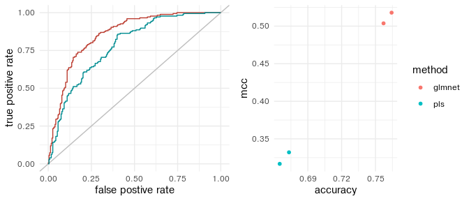

<!-- README.md is generated from README.Rmd. Please edit that file -->

# Rescience - Setting up for Reproducible Science

<!-- badges: start -->

[](https://lifecycle.r-lib.org/articles/stages.html#experimental)
<!-- badges: end -->

The goal of rescience is to provide an easy framework to test different
preprocessing and machine learning methods while minimizing the risk of
overfitting.

## Installation

You can install the development version of rescience from
[GitHub](https://github.com/JohanLassen/rescience) with:

``` r
# install.packages("devtools")
# devtools::install_github("JohanLassen/rescience")
```

## Introduction

The package includes one dataset of untargeted metabolomics on autopsies
of pneumonia deaths vs. other causes. The goal is to assist forensics
teams in assessing whether suspicious deaths has happened from natural
causes. To do this we can choose to use machine learning to make a
predictor of pneumonia vs. control and extract the important features
for model inference. Often, univariate modeling works equally well by
using false discovery rates (fdr) - especially for data with less than
50 observations. This package only implements the machine learning
pipeline as we observe a general need of reproducible ML (see below).

``` r

library(rescience)
library(tidyverse)

# dataset
knitr::kable(head(pneumonia[,1:10]), caption = 'Feature values', align = "c")
```

| id  |  group  | age | gender | weight | height |  BMI  | M363T419  | M512T603 | M364T419  |
|:---:|:-------:|:---:|:------:|:------:|:------:|:-----:|:---------:|:--------:|:---------:|
|  1  | control | 87  |   K    |   74   |  176   | 23.89 | 39263.557 | 11244.54 | 7082.998  |
|  2  | control | 48  |   K    |   52   |   NA   |  NA   | 17007.974 | 22493.90 | 6935.703  |
|  3  | control | 53  |   M    |   80   |  178   | 25.25 | 6923.392  | 55520.32 | 2572.867  |
|  4  | control | 27  |   M    |   67   |  171   | 22.91 | 23110.664 | 71463.46 | 5341.382  |
|  5  | control | 27  |   M    |   81   |  180   | 25.00 | 36682.675 | 35475.75 | 10147.962 |
|  6  | control | 49  |   M    |   NA   |  150   |  NA   | 24076.265 | 34263.70 | 5705.732  |

Feature values

To analyze this data we use the following pipeline (1) selection of
important variables including outcome, batch, and technical replicates,
(2) preprocessing to ensure that all features and compounds are within
the same range of values and to minimize batch effect, (3) perform a
machine learning model screening to evaluate which model fits the data
best. Point 2 and 3 requires caution to avoid overfitting the data, and
this package tries to provide the most robust setup.

# Motivation - Are my results reproducible?

We see an increasing trend in using PLS-based models in metabolomics
(PLS, PLS-DA, OPLS, and OPLS-DA). As these methods are supervised (use
the outcome variable), it is extremely important to perform proper
validation - ideally in the form of an independent validation set but as
a minimum in form of cross-validation. Many studies use validation, but
we also see a trend of including the infamous “PLS scores plots” in the
main text as proof of “well separation of classes”. These plots are
*never* representative of the actual performance when the number of
observations is greatly outnumbered by the number of predictors
(features).

# Running everything in your web-browser

The package is accompanied with a web app that ensures that a broad
range of users can confidently use the methods. The app exists as an
online version to show case the setup, but we recommend users to install
R, Rstudio, and this package to experience the best performance.

To run the app:

``` r
#run_app()
```

# Diving deeper

The true beauty of the package reveals itself when developing custom
scripts and implementing your own functions.

We strive to include as many different methods as possible to
accommodate methodological studies on batch effect, machine learning
algorithms, and model interpretation. Hence, it should be as easy as
possible to contribute to the package by writing functions that fits the
required data format.

For consistency we format data into a R list called ms. The ms list
contain the feature values
(ms$values) and sample meta data (ms$rowinfo).

# (1) Loading data

In the example of pneumonia we generate the ms the following way:

``` r

# First convert the pneumonia object to a tibble. 
pneumonia <- tibble(pneumonia)

# Generate list object
ms <- list()

# Assign feature values to ms$values
start_column <- 8 # The first column with feature values
end_column <- ncol(pneumonia) # The last column of the dataset
ms$values <- pneumonia[, start_column:end_column]

# Assign metadata to ms$rowinfo
ms$rowinfo <- pneumonia %>% select(rowid = id, group, age, gender, weight, height, BMI)
```

Now the ms object is made

| M363T419  | M512T603 | M364T419  | M365T392  | M186T177  |
|:---------:|:--------:|:---------:|:---------:|:---------:|
| 39263.557 | 11244.54 | 7082.998  | 54547.315 | 124593.65 |
| 17007.974 | 22493.90 | 6935.703  | 57963.620 | 76165.73  |
| 6923.392  | 55520.32 | 2572.867  | 5009.616  | 26871.19  |
| 23110.664 | 71463.46 | 5341.382  | 5785.511  | 64805.11  |
| 36682.675 | 35475.75 | 10147.962 | 10432.764 | 29821.71  |
| 24076.265 | 34263.70 | 5705.732  | 8523.413  | 12463.62  |

Feature values

| rowid |   group | age | gender | weight | height |   BMI |
|------:|--------:|----:|-------:|-------:|-------:|------:|
|     1 | control |  87 |      K |     74 |    176 | 23.89 |
|     2 | control |  48 |      K |     52 |     NA |    NA |
|     3 | control |  53 |      M |     80 |    178 | 25.25 |
|     4 | control |  27 |      M |     67 |    171 | 22.91 |
|     5 | control |  27 |      M |     81 |    180 | 25.00 |
|     6 | control |  49 |      M |     NA |    150 |    NA |

Meta Data

# Preprocessing

``` r

# fourth root transformation
ms <- transform_fourth_root(ms)

# Probabilistic quotient normalization
ms <- normalize_pqn(ms)

# Visualize distributions of first 10 compounds to see effect of preprocessing
ms$values[,1:5] %>% 
  pivot_longer(cols = everything(), names_to = "Feature") %>%
  mutate(Feature = as.factor(Feature)) %>% 
  ggplot(aes(x=value, fill = Feature)) +
  geom_histogram(position = "identity", alpha = 0.3)
#> `stat_bin()` using `bins = 30`. Pick better value with `binwidth`.
```


And if we want to see the PCA plot:

``` r

# We plot by rowid as the data doesn't have batch info, but the rowid reflects the injection order
plot_pca(ms, color_label = "rowid") 
```


# Machine learning

## Fitting multiple models

``` r

fits <- fit_models(x = ms$values, y=ms$rowinfo$group, methods = c("pls", "glmnet")) #PLS, Elastic net, Random Forest
```

## Obtaining the performance from the models

``` r

performance <- get_performance(fits)

knitr::kable(performance)
```

| method | rep  |  accuracy |       mcc |
|:-------|:-----|----------:|----------:|
| glmnet | Rep1 | 0.7571507 | 0.5037001 |
| glmnet | Rep2 | 0.7643014 | 0.5179183 |
| pls    | Rep1 | 0.6732673 | 0.3320938 |
| pls    | Rep2 | 0.6650165 | 0.3167685 |

## Plotting performance

``` r
plot_performance(fits)
```



# Motivation part 2

## Why we should never present training data as results

To showcase that the scores plots are unreliable we can generate an OPLS
model on the true data and another OPLS model on permuted (shuffled)
data. In the permuted data, the features contain no signal of the
permuted outcome variable (because it is now random). It is important to
note that we chose OPLS, but PLS produce the same results.

> The only reproducible information reported by the PLS models is the Q2
> value. This is based on cross validation of hold out data.

``` r


plot_comparison <- function(ms, nobs = NULL){
  
  if (is.null(nobs)){
    nobs = nrow(ms$values)
  } 
  
  # make sampler to simulate what happens for a smaller data set
  subsample <- sample(1:nrow(ms$values), size = nobs)
  
  # prepare data
  feature_values <- ms$values[subsample,]
  outcome        <- ms$rowinfo$group[subsample]
  outcome_perm   <- sample(outcome)
  
  # Model using original data
  opls_model_true <- ropls::opls(x = feature_values, y=outcome, orthoI=1, crossvalI=5, plotI = F, fig.pdfC = "none", info.txtC = "none")
  
  # Model using permuted data
  opls_model_perm <- ropls::opls(x = feature_values, y=outcome_perm, orthoI=1, crossvalI=5, plotI = F, fig.pdfC = "none", info.txtC = "none")

  scores_orig <- tibble(t1    = opls_model_true@scoreMN %>% as.vector(),
                        to1   = opls_model_true@orthoScoreMN %>% as.vector(),
                        group = outcome 
                        )
  
  scores_perm <- tibble(t1    = opls_model_perm@scoreMN %>% as.vector(),
                        to1   = opls_model_perm@orthoScoreMN %>% as.vector(),
                        group = outcome_perm
                        )

  original <- 
    ggplot(scores_orig, aes(x=t1, y=to1, fill=outcome))+
    geom_point(shape=21, color="white")+
    stat_ellipse(geom="polygon", 
                      alpha = 0.2,
                      show.legend = FALSE, 
                      level = 0.95)+
    labs(title = "Original data", subtitle = paste("R2Y =", opls_model_true@summaryDF$`R2Y(cum)`, "and", "Q2 =", opls_model_true@summaryDF$`Q2(cum)`))
  
  permuted <-
    ggplot(scores_perm, aes(x=t1, y=to1, fill=outcome_perm))+
    geom_point(shape=21, color="white")+
    stat_ellipse(geom="polygon", 
                      alpha = 0.2,
                      show.legend = FALSE, 
                      level = 0.95)+
    labs(title = "Permuted data", subtitle = paste("R2Y =", opls_model_perm@summaryDF$`R2Y(cum)`, "and", "Q2 =", opls_model_perm@summaryDF$`Q2(cum)`))
  
  legend <- cowplot::get_legend(original + theme(legend.box.margin = margin(0, 0, 0, 12)))
  
  plots     <- cowplot::plot_grid(original+theme(legend.position = "none"), permuted+theme(legend.position = "none"), legend, ncol=3, rel_widths = c(3, 3, .6))
  summaries <- list("permuted" = opls_model_perm@summaryDF, "original" = opls_model_true@summaryDF) %>% bind_rows(.id="data")
  
  
  return(list(plots, summaries))
}


plot_comparison(ms, nobs=100)
#> [[1]]
```


    #> 
    #> [[2]]
    #>               data R2X(cum) R2Y(cum) Q2(cum) RMSEE pre ort pR2Y  pQ2
    #> Total...1 permuted    0.119    0.555  -0.403 0.333   1   1 0.75 0.70
    #> Total...2 original    0.137    0.621   0.213 0.307   1   1 0.35 0.05
